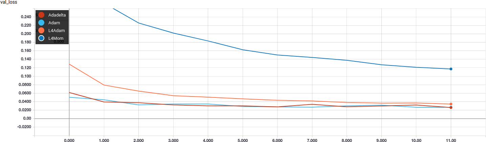

# Keras-l4
This is a Keras implementation of the L4 stepsize adaptation scheme proposed by 
Rolinek, Martius (2018) [[link]](https://arxiv.org/pdf/1802.05074v2.pdf).

The core implementation of the algorithm is taken verbatim from the [official 
repository published by the authors](https://github.com/martius-lab/l4-optimizer) 
and released under the MIT license.

I am not affiliated with the authors in any way and I am releasing this code
for non-commercial purposes. 

## Acknowledgments
Thanks to the authors of the paper, [Michal Rolínek](https://scholar.google.de/citations?user=DVdSTFQAAAAJ&hl=en)
and [Georg Martius](http://georg.playfulmachines.com/) of the [Autonomous Learning Group](https://al.is.tuebingen.mpg.de/)
at the [Max Planck Institute for Intelligent Systems](https://is.tuebingen.mpg.de/).

# Installation
To install the module:

```sh
git clone https://github.com/danielegrattarola/keras-l4
cd keras-l4
pip install .
```

Test: 
```python
from keras_l4 import L4Adam, L4Mom
```

## Results
This are the results I got by running the L4Adam and L4Mom optimizers as 
parametrized by the authors in the example code on their repo. I compared 
their performance with the default Adam and Adadelta implementations in Keras. 
I used the [`mnist_cnn.py` example](https://github.com/keras-team/keras/blob/master/examples/mnist_cnn.py)
as reference implementation for MNIST.

  
  

Output with `L4Adam(fraction=0.25)`:

```Epoch 1/12
60000/60000 [==============================] - 14s 238us/step - loss: 0.4404 - acc: 0.8677 - val_loss: 0.1286 - val_acc: 0.9613
Epoch 2/12
60000/60000 [==============================] - 13s 224us/step - loss: 0.1795 - acc: 0.9477 - val_loss: 0.0792 - val_acc: 0.9747
Epoch 3/12
60000/60000 [==============================] - 13s 224us/step - loss: 0.1300 - acc: 0.9619 - val_loss: 0.0651 - val_acc: 0.9795
Epoch 4/12
60000/60000 [==============================] - 13s 225us/step - loss: 0.1085 - acc: 0.9679 - val_loss: 0.0542 - val_acc: 0.9832
Epoch 5/12
60000/60000 [==============================] - 14s 225us/step - loss: 0.0952 - acc: 0.9715 - val_loss: 0.0508 - val_acc: 0.9832
Epoch 6/12
60000/60000 [==============================] - 13s 224us/step - loss: 0.0866 - acc: 0.9750 - val_loss: 0.0467 - val_acc: 0.9852
Epoch 7/12
60000/60000 [==============================] - 13s 223us/step - loss: 0.0792 - acc: 0.9766 - val_loss: 0.0434 - val_acc: 0.9863
Epoch 8/12
60000/60000 [==============================] - 13s 223us/step - loss: 0.0749 - acc: 0.9783 - val_loss: 0.0417 - val_acc: 0.9861
Epoch 9/12
60000/60000 [==============================] - 13s 222us/step - loss: 0.0712 - acc: 0.9788 - val_loss: 0.0382 - val_acc: 0.9875
Epoch 10/12
60000/60000 [==============================] - 13s 223us/step - loss: 0.0670 - acc: 0.9802 - val_loss: 0.0367 - val_acc: 0.9884
Epoch 11/12
60000/60000 [==============================] - 14s 225us/step - loss: 0.0625 - acc: 0.9810 - val_loss: 0.0370 - val_acc: 0.9879
Epoch 12/12
60000/60000 [==============================] - 13s 223us/step - loss: 0.0604 - acc: 0.9821 - val_loss: 0.0345 - val_acc: 0.9888
Test loss: 0.034453166176
Test accuracy: 0.9888
```

Output with `L4Mom(fraction=0.25)`:

```Epoch 1/12
60000/60000 [==============================] - 14s 226us/step - loss: 1.0907 - acc: 0.6669 - val_loss: 0.3996 - val_acc: 0.8891
Epoch 2/12
60000/60000 [==============================] - 13s 214us/step - loss: 0.5167 - acc: 0.8385 - val_loss: 0.2724 - val_acc: 0.9217
Epoch 3/12
60000/60000 [==============================] - 12s 205us/step - loss: 0.4161 - acc: 0.8734 - val_loss: 0.2257 - val_acc: 0.9344
Epoch 4/12
60000/60000 [==============================] - 13s 215us/step - loss: 0.3635 - acc: 0.8896 - val_loss: 0.2020 - val_acc: 0.9432
Epoch 5/12
60000/60000 [==============================] - 13s 222us/step - loss: 0.3357 - acc: 0.8984 - val_loss: 0.1833 - val_acc: 0.9456
Epoch 6/12
60000/60000 [==============================] - 13s 212us/step - loss: 0.3077 - acc: 0.9080 - val_loss: 0.1625 - val_acc: 0.9510
Epoch 7/12
60000/60000 [==============================] - 13s 210us/step - loss: 0.2871 - acc: 0.9127 - val_loss: 0.1501 - val_acc: 0.9564
Epoch 8/12
60000/60000 [==============================] - 13s 217us/step - loss: 0.2690 - acc: 0.9193 - val_loss: 0.1444 - val_acc: 0.9576
Epoch 9/12
60000/60000 [==============================] - 13s 215us/step - loss: 0.2576 - acc: 0.9226 - val_loss: 0.1376 - val_acc: 0.9598
Epoch 10/12
60000/60000 [==============================] - 13s 214us/step - loss: 0.2416 - acc: 0.9267 - val_loss: 0.1271 - val_acc: 0.9620
Epoch 11/12
60000/60000 [==============================] - 13s 214us/step - loss: 0.2370 - acc: 0.9293 - val_loss: 0.1212 - val_acc: 0.9639
Epoch 12/12
60000/60000 [==============================] - 13s 211us/step - loss: 0.2252 - acc: 0.9324 - val_loss: 0.1172 - val_acc: 0.9658
Test loss: 0.117155509987
Test accuracy: 0.9658
```

Output with `Adadelta()`:

```Epoch 1/12
60000/60000 [==============================] - 12s 193us/step - loss: 0.2751 - acc: 0.9157 - val_loss: 0.0616 - val_acc: 0.9794
Epoch 2/12
60000/60000 [==============================] - 11s 181us/step - loss: 0.0925 - acc: 0.9721 - val_loss: 0.0394 - val_acc: 0.9877
Epoch 3/12
60000/60000 [==============================] - 11s 189us/step - loss: 0.0693 - acc: 0.9793 - val_loss: 0.0376 - val_acc: 0.9866
Epoch 4/12
60000/60000 [==============================] - 11s 185us/step - loss: 0.0578 - acc: 0.9827 - val_loss: 0.0323 - val_acc: 0.9891
Epoch 5/12
60000/60000 [==============================] - 11s 184us/step - loss: 0.0506 - acc: 0.9855 - val_loss: 0.0302 - val_acc: 0.9902
Epoch 6/12
60000/60000 [==============================] - 11s 182us/step - loss: 0.0437 - acc: 0.9865 - val_loss: 0.0302 - val_acc: 0.9905
Epoch 7/12
60000/60000 [==============================] - 11s 183us/step - loss: 0.0402 - acc: 0.9877 - val_loss: 0.0278 - val_acc: 0.9911
Epoch 8/12
60000/60000 [==============================] - 11s 184us/step - loss: 0.0357 - acc: 0.9890 - val_loss: 0.0337 - val_acc: 0.9887
Epoch 9/12
60000/60000 [==============================] - 11s 180us/step - loss: 0.0338 - acc: 0.9895 - val_loss: 0.0280 - val_acc: 0.9908
Epoch 10/12
60000/60000 [==============================] - 11s 185us/step - loss: 0.0298 - acc: 0.9909 - val_loss: 0.0299 - val_acc: 0.9905
Epoch 11/12
60000/60000 [==============================] - 11s 186us/step - loss: 0.0302 - acc: 0.9909 - val_loss: 0.0321 - val_acc: 0.9901
Epoch 12/12
60000/60000 [==============================] - 11s 181us/step - loss: 0.0293 - acc: 0.9910 - val_loss: 0.0262 - val_acc: 0.9918
Test loss: 0.0262489689588
Test accuracy: 0.9918
```

Output with `Adam()`:

```Epoch 1/12
60000/60000 [==============================] - 12s 195us/step - loss: 0.2459 - acc: 0.9247 - val_loss: 0.0504 - val_acc: 0.9828
Epoch 2/12
60000/60000 [==============================] - 11s 178us/step - loss: 0.0848 - acc: 0.9752 - val_loss: 0.0445 - val_acc: 0.9843
Epoch 3/12
60000/60000 [==============================] - 11s 177us/step - loss: 0.0629 - acc: 0.9814 - val_loss: 0.0324 - val_acc: 0.9898
Epoch 4/12
60000/60000 [==============================] - 11s 181us/step - loss: 0.0514 - acc: 0.9841 - val_loss: 0.0347 - val_acc: 0.9895
Epoch 5/12
60000/60000 [==============================] - 11s 178us/step - loss: 0.0442 - acc: 0.9859 - val_loss: 0.0346 - val_acc: 0.9890
Epoch 6/12
60000/60000 [==============================] - 10s 174us/step - loss: 0.0379 - acc: 0.9878 - val_loss: 0.0287 - val_acc: 0.9913
Epoch 7/12
60000/60000 [==============================] - 11s 176us/step - loss: 0.0330 - acc: 0.9890 - val_loss: 0.0277 - val_acc: 0.9918
Epoch 8/12
60000/60000 [==============================] - 10s 175us/step - loss: 0.0288 - acc: 0.9908 - val_loss: 0.0270 - val_acc: 0.9919
Epoch 9/12
60000/60000 [==============================] - 10s 174us/step - loss: 0.0287 - acc: 0.9905 - val_loss: 0.0303 - val_acc: 0.9912
Epoch 10/12
60000/60000 [==============================] - 10s 173us/step - loss: 0.0234 - acc: 0.9924 - val_loss: 0.0318 - val_acc: 0.9911
Epoch 11/12
60000/60000 [==============================] - 10s 175us/step - loss: 0.0235 - acc: 0.9926 - val_loss: 0.0269 - val_acc: 0.9925
Epoch 12/12
60000/60000 [==============================] - 10s 173us/step - loss: 0.0211 - acc: 0.9930 - val_loss: 0.0269 - val_acc: 0.9930
Test loss: 0.026910884118
Test accuracy: 0.993

```